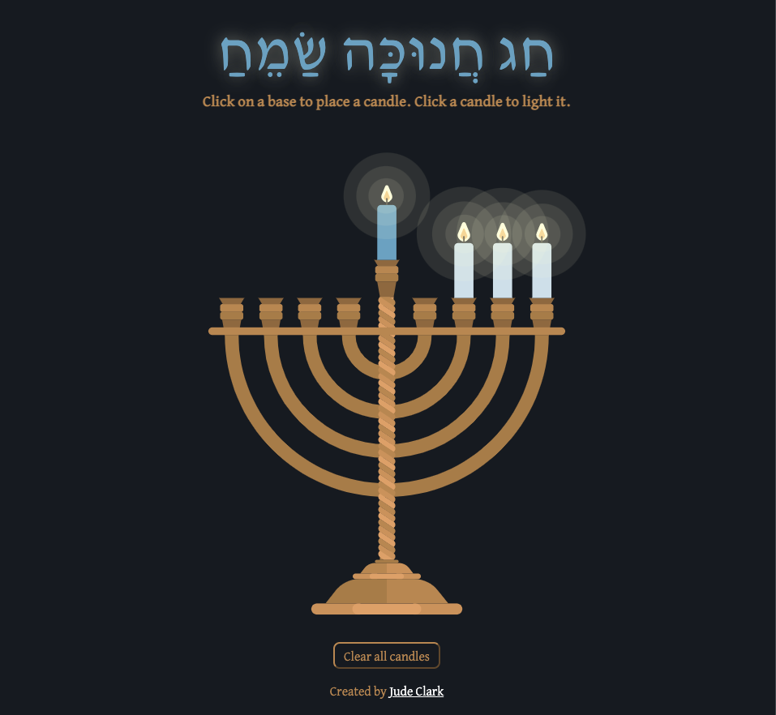

# Virtual Menorah

A menorah to share on your screen while celebrating Zoom Hanukkah. Click on a holder to place a candle in that spot. Click on the candle to light it.

Click to launch: https://spacial-fray-menorah.netlify.app

Built with <a href="https://reactjs.org/">React JS</a> and <a href="https://www.framer.com/motion/">Framer Motion</a>

### Credits

Menorah SVG: <a href="https://www.vecteezy.com/free-vector/menorah">Menorah Vectors by Vecteezy</a>

<!-- Info icon by <a href="https://www.flaticon.com/authors/freepik" title="Freepik">Freepik</a> from <a href="https://www.flaticon.com/" title="Flaticon"> www.flaticon.com</a> -->

